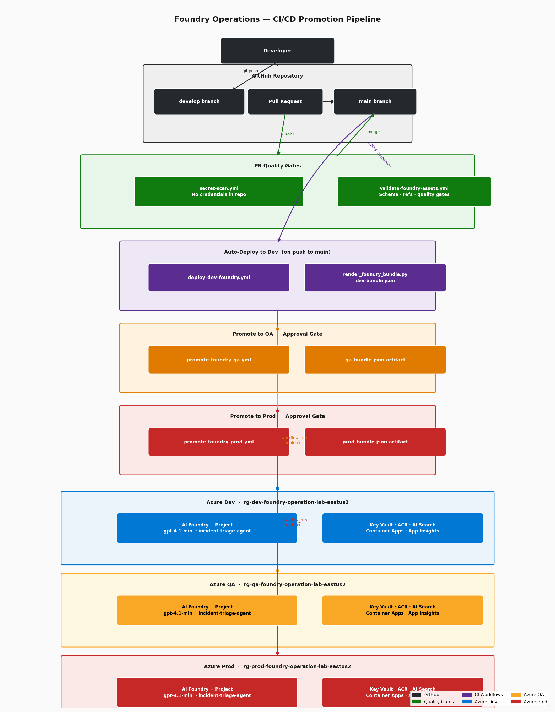
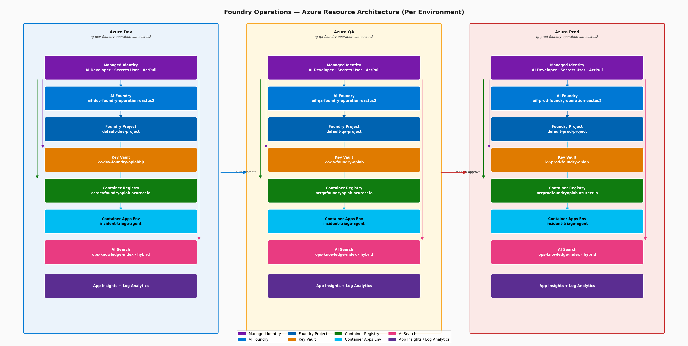

# Foundry Operations CI/CD Lab

This repository is the execution runbook for operationalizing Microsoft Foundry across three isolated environments:

1. Dev
2. QA
3. Prod

It covers prompt flow, Bicep generation and deployment, and post-deployment operationalization.

---

## Architecture Overview

### CI/CD Promotion Pipeline



**View with Azure icons:** Open [cicd-pipeline.mmd](docs/diagrams/cicd-pipeline.mmd) in [Mermaid Live](https://mermaid.live) to see detailed Azure icons for each component.

### Azure Resource Architecture — Per Environment



**View with Azure icons:** Open [azure-resources.mmd](docs/diagrams/azure-resources.mmd) in [Mermaid Live](https://mermaid.live) to see Azure service icons for Managed Identity, AI Foundry, Key Vault, Container Registry, Container Apps, AI Search, and App Insights.

---

## 1. Prompt Sequence

Run prompts in this exact order.

1. Operationalization prompt
- File: `PROMPT.md`
- Purpose: define operations model, promotion flow, governance, and controls
- Scope: no infrastructure provisioning steps

2. Infrastructure generation prompt
- File: `prompts/infra-bicep.prompt.md`
- Purpose: generate Bicep templates and parameter files
- Scope: infrastructure only (new Foundry model, required services, naming, RBAC)

3. Expected generated files
- `infra/bicep/main.bicep`
- `infra/bicep/modules/resources.bicep`
- `infra/bicep/parameters/dev.bicepparam`
- `infra/bicep/parameters/qa.bicepparam`
- `infra/bicep/parameters/prod.bicepparam`

## 2. Prerequisites Before Any Deployment

1. Azure CLI installed and authenticated
2. Correct subscription selected
3. Permission to deploy at subscription scope
4. Permission to create role assignments
5. Required provider namespaces registered

Promotion prerequisites (operational):

1. QA v2 stack is provisioned before first real QA promotion (`kb-iq-v2` knowledge base, `ks-web-v1` knowledge source, `kb-kb-iq-v2-qa` connection, `gpt-4o` deployment).
2. Prod GitHub Environment has required reviewers configured in repository settings.

Commands:

```bash
az account show --output table
az account set --subscription "<subscription-id-or-name>"

az provider register --namespace Microsoft.CognitiveServices
az provider register --namespace Microsoft.MachineLearningServices
az provider register --namespace Microsoft.App
az provider register --namespace Microsoft.Search
az provider register --namespace Microsoft.KeyVault
az provider register --namespace Microsoft.ContainerRegistry
az provider register --namespace Microsoft.OperationalInsights
```

## 3. Once Bicep Files Are Created: Immediate Next Steps

### 3.1 Validate compilation

```bash
az bicep build --file infra/bicep/main.bicep
az bicep build-params --file infra/bicep/parameters/dev.bicepparam
az bicep build-params --file infra/bicep/parameters/qa.bicepparam
az bicep build-params --file infra/bicep/parameters/prod.bicepparam
```

### 3.2 Validate parameter intent

1. `environmentName` is `dev`, `qa`, `prod` in the right files
2. `location` is `eastus2` unless intentionally changed
3. `foundryAdminObjectId` is set only when needed

### 3.3 Confirm naming and model assumptions

1. Names are derived from environment and location (not hardcoded)
2. Foundry resource uses new model: `Microsoft.CognitiveServices/accounts` with `kind: AIFoundry`
3. Project uses `Microsoft.MachineLearningServices/workspaces` with `kind: Project`

### 3.4 Run what-if for each environment

```bash
az deployment sub what-if \
  --location eastus2 \
  --template-file infra/bicep/main.bicep \
  --parameters infra/bicep/parameters/dev.bicepparam

az deployment sub what-if \
  --location eastus2 \
  --template-file infra/bicep/main.bicep \
  --parameters infra/bicep/parameters/qa.bicepparam

az deployment sub what-if \
  --location eastus2 \
  --template-file infra/bicep/main.bicep \
  --parameters infra/bicep/parameters/prod.bicepparam
```

Review what-if output for:

1. Resource names and counts
2. Role assignment scopes
3. SKU differences across Dev/QA/Prod

## 4. Deploy Infrastructure (Dev -> QA -> Prod)

Deploy in this order only.

```bash
az deployment sub create \
  --location eastus2 \
  --template-file infra/bicep/main.bicep \
  --parameters infra/bicep/parameters/dev.bicepparam

az deployment sub create \
  --location eastus2 \
  --template-file infra/bicep/main.bicep \
  --parameters infra/bicep/parameters/qa.bicepparam

az deployment sub create \
  --location eastus2 \
  --template-file infra/bicep/main.bicep \
  --parameters infra/bicep/parameters/prod.bicepparam
```

### 4.1 Azure AI Search index bootstrap behavior

The Bicep module includes code to create an Azure AI Search index named `default` in each environment as part of deployment.

- Implementation location: `infra/bicep/modules/resources.bicep` resource `aiSearchDefaultIndex` (`Microsoft.Resources/deploymentScripts`)
- Output surface: `aiSearchIndexName` from `infra/bicep/main.bicep`

Verify index existence after each deployment:

```bash
SEARCH_SERVICE=srch-dev-foundry-oplab-eus2
RG=rg-dev-foundry-operation-lab-eastus2
ADMIN_KEY=$(az search admin-key show --service-name "$SEARCH_SERVICE" --resource-group "$RG" --query primaryKey -o tsv)
az rest --method get \
  --url "https://${SEARCH_SERVICE}.search.windows.net/indexes/default?api-version=2024-07-01" \
  --headers "api-key=${ADMIN_KEY}" \
  --output json
```

If your organization blocks shared-key auth on the storage account used by deployment scripts, deployments can fail with `KeyBasedAuthenticationNotPermitted` during index bootstrap.
In that case, create the same index directly with CLI and continue:

```bash
SEARCH_SERVICE=srch-qa-foundry-oplab-eus2
RG=rg-qa-foundry-operation-lab-eastus2
ADMIN_KEY=$(az search admin-key show --service-name "$SEARCH_SERVICE" --resource-group "$RG" --query primaryKey -o tsv)

BODY='{"name":"default","fields":[{"name":"id","type":"Edm.String","key":true,"searchable":false,"filterable":true,"sortable":false,"facetable":false}]}'

az rest --method put \
  --url "https://${SEARCH_SERVICE}.search.windows.net/indexes/default?api-version=2024-07-01" \
  --headers "Content-Type=application/json" "api-key=${ADMIN_KEY}" \
  --body "$BODY" \
  --output json
```

## 5. Once Resources Are Created Through Bicep: Next Steps

### 5.0 Branching policy (required)

1. Make all repository changes on `develop` (or a short-lived feature branch created from `develop`).
2. Promote changes only through a pull request into `main`.
3. Do not push directly to `main`.
4. Merge to `main` is the release signal for deployment workflows.

### 5.1 Platform validation

1. Confirm resource groups and key resources exist in each environment
2. Confirm managed identity role assignments are present
3. Confirm Key Vault RBAC access works for expected identities
4. Confirm ACR pull access works for self-hosted agent identities

### 5.2 Foundry baseline per environment

1. Configure model deployments
2. Create or configure Foundry project assets
3. Configure Foundry IQ, memory, tools, and guardrails
4. Record environment-specific configuration deltas

### 5.3 Agent deployment baseline

1. Deploy Foundry-hosted agent baseline
2. Build and push ACA agent image to ACR
3. Deploy ACA self-hosted agent to Container Apps Environment
4. Validate both hosted patterns with smoke tests

### 5.4 Observability and controls

1. Confirm logs flow to Log Analytics
2. Confirm telemetry in Application Insights
3. Add alerts for availability, error rate, latency, and deployment failures
4. Define rollback steps for model, prompt, and guardrail changes

### 5.5 CI/CD promotion workflow

1. `validate-foundry-assets.yml` triggers on PR and on push to `main` (scoped paths) and enforces strict validation plus bundle rendering checks.
2. `deploy-dev-foundry.yml` triggers on push to `main` (scoped paths) and manual dispatch; it validates strictly, renders artifacts, runs dry-run pre-flight, then deploys to Dev.
3. `promote-foundry-qa.yml` triggers on successful `deploy-dev-foundry` workflow completion and manual dispatch; it runs strict validation, dry-run pre-flight, live deploy, then post-deploy multi-KB verification.
4. `promote-foundry-prod.yml` triggers on successful `promote-foundry-qa` workflow completion and manual dispatch; it runs preflight in one job and live deploy plus verification in a separate prod-gated job.
5. `export-sync.yml` triggers on manual dispatch; it exports from a selected source environment, validates strictly, and opens a PR against `develop` when deltas exist.

QA and Prod promotions require a pre-flight dry-run to pass before live deploy runs. Reviewers can inspect the dry-run output in workflow logs before approving any downstream promotion step.

Prod promotion requires GitHub Environment approval. Required reviewers are configured in GitHub repository/environment settings, not in workflow YAML.

Future work note: `.github/workflows/release-foundry-bundle.yml` exists as a reusable `workflow_call` template but is not currently invoked by active deploy workflows. Consider consolidating env-specific workflows to call it in a later refactor.

### 5.6 Foundry asset reconciliation (Dev -> QA -> Prod)

Use this as the source-of-truth workflow for portal-originated changes (for example, a new knowledge base attached to an agent in Dev).

1. Make the change in Dev Foundry only.
2. Run the `export-sync` workflow from GitHub Actions UI with agent name and source environment. The workflow exports, validates, and opens a PR against `develop`.

3. Open PR with the changed `foundry/` JSON files.
4. Validation pipeline enforces portable metadata (no Dev ARM IDs or hardcoded Dev search URLs).
5. Merge to `main`.
6. Promotion workflows deploy the same metadata to QA and Prod; deployer resolves environment-specific connection names/endpoints at runtime.

Portability rules (enforced by `scripts/validate_foundry_assets.py`):

1. Do not commit environment-pinned hostnames in metadata values.
2. Do not commit absolute ARM resource paths (for example `connectionId`) in portable Foundry assets.
3. Do not commit platform-managed metadata such as `etag`, `@odata.etag`, `@odata.context`, `createdDateTime`, or `lastModifiedDateTime`.
4. `mcpServerLabel` must be environment-agnostic (no env suffixes like `-dev`, `-qa`, `-prod`).
5. `mcpServerUrlTemplate` must contain both `{searchEndpointHost}` and `{knowledgeBaseName}`.
6. `resourceUri` under `azureOpenAIParameters` must use `{azureOpenAIAccountHost}`.
7. `projectConnectionNameTemplate` must include `{connectionNameSuffix}`.

Schema conventions:

1. Agents use `foundryIqRefs` (array) with one entry per attached knowledge base.
2. Legacy singular fields `foundryIqRef`, `knowledgeRef`, and `knowledgeIndexRef` are removed from active assets.

Archive conventions:

1. Files removed during migration are retained under `foundry/_archive/` for historical reference and are excluded from active validation/deploy flows.

### 5.7 Local development workflow

1. Run strict validator locally:

```bash
python scripts/validate_foundry_assets.py --strict
```

2. Run deploy dry-run locally:

```bash
python scripts/deploy_agent_to_foundry.py --agent-name <name> --environment <env> --dry-run
```

3. Run deployed-state verification locally:

```bash
python scripts/verify_deployed_agent.py --agent-name <name> --environment <env>
```

4. Use `--dry-run` as the safe inspection mode: it renders assets, executes pre-flight checks, and prints planned actions without mutating live environments.

## 6. Recommended Pipeline Gates

Use these quality gates before each promotion.

1. Infra gate
- Bicep compile and what-if clean

2. Security gate
- RBAC checks, secret references, no hardcoded secrets

3. Functional gate
- API/agent smoke tests

4. Quality gate
- Evaluation dataset score thresholds

5. Operational gate
- Alerts, logs, and traces visible after deployment

## 7. Suggested Day-0 to Day-2 Plan

1. Day 0
- Finalize prompts
- Regenerate Bicep if needed
- Compile and run what-if

2. Day 1
- Deploy Dev and QA
- Configure Foundry assets and both agent patterns
- Enable observability and validation checks

3. Day 2
- Deploy Prod
- Run full Dev -> QA -> Prod promotion demo
- Capture outcomes, risks, and next improvements

## 8. Exit Criteria

This run is complete when:

1. All three environments are provisioned
2. Foundry-hosted and ACA-hosted agents are both operational
3. Dev -> QA -> Prod promotion is demonstrated end-to-end
4. Observability and alerting are active
5. Rollback approach is documented and tested

## 9. One-Command-at-a-Time Runbook

Use this section when executing live. Run commands top to bottom.

### 9.1 Set subscription and register providers

```bash
az account show --output table
az account set --subscription "<subscription-id-or-name>"
az provider register --namespace Microsoft.CognitiveServices
az provider register --namespace Microsoft.MachineLearningServices
az provider register --namespace Microsoft.App
az provider register --namespace Microsoft.Search
az provider register --namespace Microsoft.KeyVault
az provider register --namespace Microsoft.ContainerRegistry
az provider register --namespace Microsoft.OperationalInsights
```

### 9.2 Compile validation

```bash
az bicep build --file infra/bicep/main.bicep
az bicep build-params --file infra/bicep/parameters/dev.bicepparam
az bicep build-params --file infra/bicep/parameters/qa.bicepparam
az bicep build-params --file infra/bicep/parameters/prod.bicepparam
```

### 9.3 What-if validation

```bash
az deployment sub what-if --location eastus2 --template-file infra/bicep/main.bicep --parameters infra/bicep/parameters/dev.bicepparam
az deployment sub what-if --location eastus2 --template-file infra/bicep/main.bicep --parameters infra/bicep/parameters/qa.bicepparam
az deployment sub what-if --location eastus2 --template-file infra/bicep/main.bicep --parameters infra/bicep/parameters/prod.bicepparam
```

### 9.4 Deploy Dev

```bash
az deployment sub create --name dep-foundry-dev --location eastus2 --template-file infra/bicep/main.bicep --parameters infra/bicep/parameters/dev.bicepparam
```

Quick verify Dev:

```bash
az group show --name rg-dev-foundry-operation-lab-eastus2 --output table
az cognitiveservices account show --name aif-dev-foundry-operation-eastus2 --resource-group rg-dev-foundry-operation-lab-eastus2 --output table
```

### 9.5 Deploy QA

```bash
az deployment sub create --name dep-foundry-qa --location eastus2 --template-file infra/bicep/main.bicep --parameters infra/bicep/parameters/qa.bicepparam
```

Quick verify QA:

```bash
az group show --name rg-qa-foundry-operation-lab-eastus2 --output table
az cognitiveservices account show --name aif-qa-foundry-operation-eastus2 --resource-group rg-qa-foundry-operation-lab-eastus2 --output table
```

### 9.6 Deploy Prod

```bash
az deployment sub create --name dep-foundry-prod --location eastus2 --template-file infra/bicep/main.bicep --parameters infra/bicep/parameters/prod.bicepparam
```

Quick verify Prod:

```bash
az group show --name rg-prod-foundry-operation-lab-eastus2 --output table
az cognitiveservices account show --name aif-prod-foundry-operation-eastus2 --resource-group rg-prod-foundry-operation-lab-eastus2 --output table
```

### 9.7 Post-deployment sanity checks (all environments)

```bash
az resource list --resource-group rg-dev-foundry-operation-lab-eastus2 --output table
az resource list --resource-group rg-qa-foundry-operation-lab-eastus2 --output table
az resource list --resource-group rg-prod-foundry-operation-lab-eastus2 --output table
```

### 9.8 Verify default search index (all environments)

```bash
for env in dev qa prod; do
  SEARCH_SERVICE="srch-${env}-foundry-oplab-eus2"
  RG="rg-${env}-foundry-operation-lab-eastus2"
  ADMIN_KEY=$(az search admin-key show --service-name "$SEARCH_SERVICE" --resource-group "$RG" --query primaryKey -o tsv)
  echo "Checking ${env}..."
  az rest --method get \
    --url "https://${SEARCH_SERVICE}.search.windows.net/indexes/default?api-version=2024-07-01" \
    --headers "api-key=${ADMIN_KEY}" \
    --query "name" -o tsv
done
```

### 9.9 Start operationalization phase

After infra verification succeeds in all three environments:

1. Configure Foundry model deployments per environment.
2. Configure project assets (IQ, memory, tools, guardrails).
3. Deploy Foundry-hosted and ACA-hosted agents.
4. Enable CI/CD promotion gates from Dev to QA to Prod.
