# Foundry Operations CI/CD Lab

This repository is the execution runbook for operationalizing Microsoft Foundry across three isolated environments:

1. Dev
2. QA
3. Prod

It covers prompt flow, Bicep generation and deployment, and post-deployment operationalization.

---

## Architecture Overview

### CI/CD Promotion Pipeline

```mermaid
%%{init: {'theme': 'base', 'themeVariables': {'primaryColor': '#0078D4', 'primaryTextColor': '#fff', 'primaryBorderColor': '#005a9e', 'lineColor': '#444', 'secondaryColor': '#ddeeff', 'tertiaryColor': '#f5f5f5'}}}%%
flowchart TD
    DEVELOPER(["👩‍💻 Developer"])

    subgraph GH_REPO["GitHub Repository"]
        direction LR
        DEV_BR["develop branch"]
        PR_NODE(["Pull Request"])
        MAIN_BR["main branch"]
    end

    subgraph PR_GATES["PR Quality Gates"]
        direction LR
        SCAN_WF["🔒 secret-scan.yml\nNo credentials in repo"]
        VALID_WF["✅ validate-foundry-assets.yml\nSchema · refs · quality gate profiles"]
    end

    subgraph CI_DEV["🔵 Auto-Deploy to Dev  —  on push to main"]
        WF_DEV["deploy-dev-foundry.yml"]
        ART_DEV["render_foundry_bundle.py\ndev-bundle.json artifact"]
    end

    subgraph CI_QA["🟡 Promote to QA  ⏸ Approval Gate"]
        WF_QA["promote-foundry-qa.yml"]
        ART_QA["qa-bundle.json artifact"]
    end

    subgraph CI_PROD["🟠 Promote to Prod  ⏸ Approval Gate"]
        WF_PROD["promote-foundry-prod.yml"]
        ART_PROD["prod-bundle.json artifact"]
    end

    subgraph AZ_DEV["☁️ Azure Dev  ·  rg-dev-foundry-operation-lab-eastus2"]
        direction LR
        AZ_D1["🤖 AI Foundry + Project\ngpt-4.1-mini · incident-triage-agent"]
        AZ_D2["Key Vault · ACR · AI Search\nContainer Apps Env · App Insights"]
    end

    subgraph AZ_QA["☁️ Azure QA  ·  rg-qa-foundry-operation-lab-eastus2"]
        direction LR
        AZ_Q1["🤖 AI Foundry + Project\ngpt-4.1-mini · incident-triage-agent"]
        AZ_Q2["Key Vault · ACR · AI Search\nContainer Apps Env · App Insights"]
    end

    subgraph AZ_PROD["☁️ Azure Prod  ·  rg-prod-foundry-operation-lab-eastus2"]
        direction LR
        AZ_P1["🤖 AI Foundry + Project\ngpt-4.1-mini · incident-triage-agent"]
        AZ_P2["Key Vault · ACR · AI Search\nContainer Apps Env · App Insights"]
    end

    DEVELOPER -->|"git push"| DEV_BR
    DEV_BR -->|"open PR"| PR_NODE
    PR_NODE --> PR_GATES
    PR_GATES -->|"checks pass · merge"| MAIN_BR
    MAIN_BR -->|"paths: foundry/** · environments/dev/**"| CI_DEV
    CI_DEV --> AZ_DEV
    AZ_DEV -->|"on: workflow_run completed"| CI_QA
    CI_QA --> AZ_QA
    AZ_QA -->|"on: workflow_run completed"| CI_PROD
    CI_PROD --> AZ_PROD

    classDef azBox fill:#0078D4,color:#fff,stroke:#005a9e
    classDef checkBox fill:#107C10,color:#fff,stroke:#094d09
    classDef ciBox fill:#5C2D91,color:#fff,stroke:#3a1c5e
    classDef ghBox fill:#24292E,color:#fff,stroke:#111

    class AZ_D1,AZ_D2,AZ_Q1,AZ_Q2,AZ_P1,AZ_P2 azBox
    class SCAN_WF,VALID_WF checkBox
    class WF_DEV,ART_DEV,WF_QA,ART_QA,WF_PROD,ART_PROD ciBox
    class DEV_BR,PR_NODE,MAIN_BR ghBox
```



### Azure Resource Architecture — Per Environment

```mermaid
%%{init: {'theme': 'base', 'themeVariables': {'primaryColor': '#0078D4', 'primaryTextColor': '#fff', 'primaryBorderColor': '#005a9e', 'lineColor': '#0078D4', 'secondaryColor': '#ddeeff', 'tertiaryColor': '#f5f5f5'}}}%%
flowchart LR
    subgraph DEV_RG["☁️ rg-dev-foundry-operation-lab-eastus2"]
        direction TB
        D_MI["🔑 Managed Identity\nAzure AI Developer · Secrets User\nAcrPull · Search Contributor"]
        D_AIF["🤖 AI Foundry\naif-dev-foundry-operation-eastus2"]
        D_PROJ["📋 Foundry Project\ndefault-dev-project"]
        D_KV["🔐 Key Vault\nkv-dev-foundry-oplabhjt"]
        D_ACR["📦 Container Registry\nacrdevfoundryoplab.azurecr.io"]
        D_ACA["🚀 Container Apps Env\nACA-hosted incident-triage-agent"]
        D_SRCH["🔍 AI Search\nops-knowledge-index · hybrid retrieval"]
        D_OBS["📊 App Insights + Log Analytics"]
        D_MI --> D_AIF & D_KV & D_ACR & D_SRCH
        D_AIF --> D_PROJ
        D_PROJ --> D_ACA
    end

    subgraph QA_RG["☁️ rg-qa-foundry-operation-lab-eastus2"]
        direction TB
        Q_MI["🔑 Managed Identity"]
        Q_AIF["🤖 AI Foundry\naif-qa-foundry-operation-eastus2"]
        Q_PROJ["📋 Foundry Project\ndefault-qa-project"]
        Q_KV["🔐 Key Vault"]
        Q_ACR["📦 Container Registry"]
        Q_ACA["🚀 Container Apps Env"]
        Q_SRCH["🔍 AI Search"]
        Q_OBS["📊 App Insights + Log Analytics"]
        Q_MI --> Q_AIF & Q_KV & Q_ACR & Q_SRCH
        Q_AIF --> Q_PROJ
        Q_PROJ --> Q_ACA
    end

    subgraph PROD_RG["☁️ rg-prod-foundry-operation-lab-eastus2"]
        direction TB
        P_MI["🔑 Managed Identity"]
        P_AIF["🤖 AI Foundry\naif-prod-foundry-operation-eastus2"]
        P_PROJ["📋 Foundry Project\ndefault-prod-project"]
        P_KV["🔐 Key Vault"]
        P_ACR["📦 Container Registry"]
        P_ACA["🚀 Container Apps Env"]
        P_SRCH["🔍 AI Search"]
        P_OBS["📊 App Insights + Log Analytics"]
        P_MI --> P_AIF & P_KV & P_ACR & P_SRCH
        P_AIF --> P_PROJ
        P_PROJ --> P_ACA
    end

    DEV_RG -->|"auto-promote on CI success"| QA_RG
    QA_RG -->|"manual approve then promote"| PROD_RG

    classDef miStyle fill:#7719AA,color:#fff,stroke:#5a127f
    classDef foundryStyle fill:#0078D4,color:#fff,stroke:#005a9e
    classDef projStyle fill:#0063B1,color:#fff,stroke:#004f8e
    classDef kvStyle fill:#FF8C00,color:#fff,stroke:#cc7000
    classDef acrStyle fill:#107C10,color:#fff,stroke:#094d09
    classDef acaStyle fill:#00BCF2,color:#000,stroke:#009cc9
    classDef searchStyle fill:#E93B81,color:#fff,stroke:#c72d6a
    classDef obsStyle fill:#773ADC,color:#fff,stroke:#5a2bb0

    class D_MI,Q_MI,P_MI miStyle
    class D_AIF,Q_AIF,P_AIF foundryStyle
    class D_PROJ,Q_PROJ,P_PROJ projStyle
    class D_KV,Q_KV,P_KV kvStyle
    class D_ACR,Q_ACR,P_ACR acrStyle
    class D_ACA,Q_ACA,P_ACA acaStyle
    class D_SRCH,Q_SRCH,P_SRCH searchStyle
    class D_OBS,Q_OBS,P_OBS obsStyle
```



---

## 1. Prompt Sequence

Run prompts in this exact order.

1. Operationalization prompt
- File: `PROMPT.md`
- Purpose: define operations model, promotion flow, governance, and controls
- Scope: no infrastructure provisioning steps

2. Infrastructure generation prompt
- File: `prompts/infra-bicep.prompt.md`
- Purpose: generate Bicep templates and parameter files
- Scope: infrastructure only (new Foundry model, required services, naming, RBAC)

3. Expected generated files
- `infra/bicep/main.bicep`
- `infra/bicep/modules/resources.bicep`
- `infra/bicep/parameters/dev.bicepparam`
- `infra/bicep/parameters/qa.bicepparam`
- `infra/bicep/parameters/prod.bicepparam`

## 2. Prerequisites Before Any Deployment

1. Azure CLI installed and authenticated
2. Correct subscription selected
3. Permission to deploy at subscription scope
4. Permission to create role assignments
5. Required provider namespaces registered

Commands:

```bash
az account show --output table
az account set --subscription "<subscription-id-or-name>"

az provider register --namespace Microsoft.CognitiveServices
az provider register --namespace Microsoft.MachineLearningServices
az provider register --namespace Microsoft.App
az provider register --namespace Microsoft.Search
az provider register --namespace Microsoft.KeyVault
az provider register --namespace Microsoft.ContainerRegistry
az provider register --namespace Microsoft.OperationalInsights
```

## 3. Once Bicep Files Are Created: Immediate Next Steps

### 3.1 Validate compilation

```bash
az bicep build --file infra/bicep/main.bicep
az bicep build-params --file infra/bicep/parameters/dev.bicepparam
az bicep build-params --file infra/bicep/parameters/qa.bicepparam
az bicep build-params --file infra/bicep/parameters/prod.bicepparam
```

### 3.2 Validate parameter intent

1. `environmentName` is `dev`, `qa`, `prod` in the right files
2. `location` is `eastus2` unless intentionally changed
3. `foundryAdminObjectId` is set only when needed

### 3.3 Confirm naming and model assumptions

1. Names are derived from environment and location (not hardcoded)
2. Foundry resource uses new model: `Microsoft.CognitiveServices/accounts` with `kind: AIFoundry`
3. Project uses `Microsoft.MachineLearningServices/workspaces` with `kind: Project`

### 3.4 Run what-if for each environment

```bash
az deployment sub what-if \
  --location eastus2 \
  --template-file infra/bicep/main.bicep \
  --parameters infra/bicep/parameters/dev.bicepparam

az deployment sub what-if \
  --location eastus2 \
  --template-file infra/bicep/main.bicep \
  --parameters infra/bicep/parameters/qa.bicepparam

az deployment sub what-if \
  --location eastus2 \
  --template-file infra/bicep/main.bicep \
  --parameters infra/bicep/parameters/prod.bicepparam
```

Review what-if output for:

1. Resource names and counts
2. Role assignment scopes
3. SKU differences across Dev/QA/Prod

## 4. Deploy Infrastructure (Dev -> QA -> Prod)

Deploy in this order only.

```bash
az deployment sub create \
  --location eastus2 \
  --template-file infra/bicep/main.bicep \
  --parameters infra/bicep/parameters/dev.bicepparam

az deployment sub create \
  --location eastus2 \
  --template-file infra/bicep/main.bicep \
  --parameters infra/bicep/parameters/qa.bicepparam

az deployment sub create \
  --location eastus2 \
  --template-file infra/bicep/main.bicep \
  --parameters infra/bicep/parameters/prod.bicepparam
```

## 5. Once Resources Are Created Through Bicep: Next Steps

### 5.1 Platform validation

1. Confirm resource groups and key resources exist in each environment
2. Confirm managed identity role assignments are present
3. Confirm Key Vault RBAC access works for expected identities
4. Confirm ACR pull access works for self-hosted agent identities

### 5.2 Foundry baseline per environment

1. Configure model deployments
2. Create or configure Foundry project assets
3. Configure Foundry IQ, memory, tools, and guardrails
4. Record environment-specific configuration deltas

### 5.3 Agent deployment baseline

1. Deploy Foundry-hosted agent baseline
2. Build and push ACA agent image to ACR
3. Deploy ACA self-hosted agent to Container Apps Environment
4. Validate both hosted patterns with smoke tests

### 5.4 Observability and controls

1. Confirm logs flow to Log Analytics
2. Confirm telemetry in Application Insights
3. Add alerts for availability, error rate, latency, and deployment failures
4. Define rollback steps for model, prompt, and guardrail changes

### 5.5 CI/CD promotion workflow

1. Dev changes: model, prompt, tool, guardrail, or agent update
2. Automatic validation: lint, compile, tests, eval datasets
3. Promote to QA on passing gates
4. QA verification and approval checkpoint
5. Promote to Prod with manual approval and post-deploy validation

## 6. Recommended Pipeline Gates

Use these quality gates before each promotion.

1. Infra gate
- Bicep compile and what-if clean

2. Security gate
- RBAC checks, secret references, no hardcoded secrets

3. Functional gate
- API/agent smoke tests

4. Quality gate
- Evaluation dataset score thresholds

5. Operational gate
- Alerts, logs, and traces visible after deployment

## 7. Suggested Day-0 to Day-2 Plan

1. Day 0
- Finalize prompts
- Regenerate Bicep if needed
- Compile and run what-if

2. Day 1
- Deploy Dev and QA
- Configure Foundry assets and both agent patterns
- Enable observability and validation checks

3. Day 2
- Deploy Prod
- Run full Dev -> QA -> Prod promotion demo
- Capture outcomes, risks, and next improvements

## 8. Exit Criteria

This run is complete when:

1. All three environments are provisioned
2. Foundry-hosted and ACA-hosted agents are both operational
3. Dev -> QA -> Prod promotion is demonstrated end-to-end
4. Observability and alerting are active
5. Rollback approach is documented and tested

## 9. One-Command-at-a-Time Runbook

Use this section when executing live. Run commands top to bottom.

### 9.1 Set subscription and register providers

```bash
az account show --output table
az account set --subscription "<subscription-id-or-name>"
az provider register --namespace Microsoft.CognitiveServices
az provider register --namespace Microsoft.MachineLearningServices
az provider register --namespace Microsoft.App
az provider register --namespace Microsoft.Search
az provider register --namespace Microsoft.KeyVault
az provider register --namespace Microsoft.ContainerRegistry
az provider register --namespace Microsoft.OperationalInsights
```

### 9.2 Compile validation

```bash
az bicep build --file infra/bicep/main.bicep
az bicep build-params --file infra/bicep/parameters/dev.bicepparam
az bicep build-params --file infra/bicep/parameters/qa.bicepparam
az bicep build-params --file infra/bicep/parameters/prod.bicepparam
```

### 9.3 What-if validation

```bash
az deployment sub what-if --location eastus2 --template-file infra/bicep/main.bicep --parameters infra/bicep/parameters/dev.bicepparam
az deployment sub what-if --location eastus2 --template-file infra/bicep/main.bicep --parameters infra/bicep/parameters/qa.bicepparam
az deployment sub what-if --location eastus2 --template-file infra/bicep/main.bicep --parameters infra/bicep/parameters/prod.bicepparam
```

### 9.4 Deploy Dev

```bash
az deployment sub create --name dep-foundry-dev --location eastus2 --template-file infra/bicep/main.bicep --parameters infra/bicep/parameters/dev.bicepparam
```

Quick verify Dev:

```bash
az group show --name rg-dev-foundry-operation-lab-eastus2 --output table
az cognitiveservices account show --name aif-dev-foundry-operation-eastus2 --resource-group rg-dev-foundry-operation-lab-eastus2 --output table
```

### 9.5 Deploy QA

```bash
az deployment sub create --name dep-foundry-qa --location eastus2 --template-file infra/bicep/main.bicep --parameters infra/bicep/parameters/qa.bicepparam
```

Quick verify QA:

```bash
az group show --name rg-qa-foundry-operation-lab-eastus2 --output table
az cognitiveservices account show --name aif-qa-foundry-operation-eastus2 --resource-group rg-qa-foundry-operation-lab-eastus2 --output table
```

### 9.6 Deploy Prod

```bash
az deployment sub create --name dep-foundry-prod --location eastus2 --template-file infra/bicep/main.bicep --parameters infra/bicep/parameters/prod.bicepparam
```

Quick verify Prod:

```bash
az group show --name rg-prod-foundry-operation-lab-eastus2 --output table
az cognitiveservices account show --name aif-prod-foundry-operation-eastus2 --resource-group rg-prod-foundry-operation-lab-eastus2 --output table
```

### 9.7 Post-deployment sanity checks (all environments)

```bash
az resource list --resource-group rg-dev-foundry-operation-lab-eastus2 --output table
az resource list --resource-group rg-qa-foundry-operation-lab-eastus2 --output table
az resource list --resource-group rg-prod-foundry-operation-lab-eastus2 --output table
```

### 9.8 Start operationalization phase

After infra verification succeeds in all three environments:

1. Configure Foundry model deployments per environment.
2. Configure project assets (IQ, memory, tools, guardrails).
3. Deploy Foundry-hosted and ACA-hosted agents.
4. Enable CI/CD promotion gates from Dev to QA to Prod.
